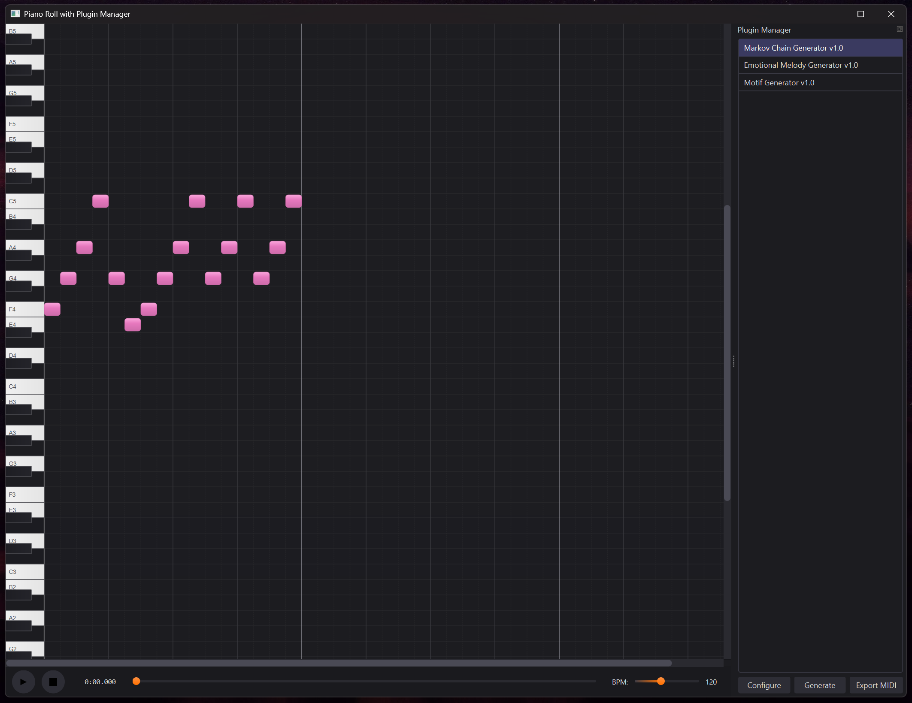
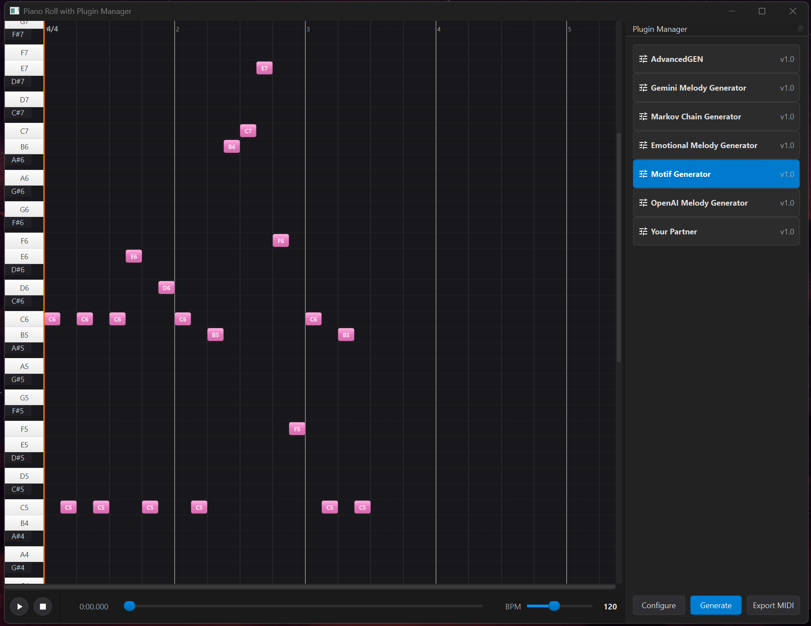

# 🎹 MIDI Generator Piano Roll


> 🎼 A plugin-powered standalone piano roll app written in Python that lets you generate MIDI using motif and Markov algorithms, visualize them, play them, and export to `.mid`.

---

## ✨ Key Features

- 🎹 **Modern Piano Roll** with grid lines, time ruler, and MIDI notes  
- 🧩 **Plugin Manager** to run motif, Markov, and custom generation logic  
- 🔌 **Drop-in Python Plugins** – Easily extend the app with your own `.py` files  
- 🛠️ **Dynamic Parameter Dialogs** – Each plugin has its own customizable settings  
- 📤 **Export to MIDI** with velocity/pitch embedded (even if not shown in UI)  
- ⏯ **Playback Controls** with beat-synced transport  
- 🪟 **Dockable Plugin Panel** – Plugin Manager can be dragged, floated, and reattached  

---

## 🖼️ Screenshots

### 🎼 Generated MIDI using Motif Generator  


### 🧠 Markov Chain Plugin Output + Plugin Panel Floating  


---

## 🧩 Plugin System

The plugin system is modular and developer-friendly:

```python
class MyCustomGenerator(PluginBase):
    def generate(self, **params):
        return [
            pretty_midi.Note(
                pitch=64,
                velocity=100,
                start=0.0,
                end=0.5
            )
        ]
```

Define `generate()` and return a list of PrettyMIDI notes.  
Add an optional `get_parameter_info()` to customize UI controls per plugin.

📖 Full developer reference: [docs/plugin-docs.md](./docs/plugin-docs.md)

---

## 🛠️ Project Structure

```
piano_roll_project/
├── main.py               # Entry point
├── piano_roll.py         # GUI and plugin panel
├── note_display.py       # Piano roll renderer
├── plugin_api.py         # Plugin contract
├── plugin_manager.py     # Dynamic plugin loader
├── export_utils.py       # MIDI writer
├── midi_player.py        # Internal MIDI sequencer
├── plugins/
│   ├── markov_generator.py
│   ├── motif_generator.py
│   └── melody_generator.py
└── docs/
    ├── project-details.md
    └── plugin-docs.md
```

---

## 🚀 Getting Started

### 1. Clone the repository

```bash
git clone https://github.com/WebChatAppAi/midi-gen.git
cd midi-gen
```

### 2. Install dependencies

```bash
pip install PySide6 pretty_midi numpy
```

### 3. Run the app

```bash
python main.py
```

---

## 🎛 How To Use

1. Open the app  
2. Pick a plugin from the Plugin Manager  
3. Click **Configure** to tweak plugin settings  
4. Click **Generate** to add notes  
5. Press **Play** or **Export MIDI** when ready  

---

## 💎 Extra Capabilities

- 🧩 Easily add your own plugins via `plugins/*.py`  
- 🖱 Plugin Manager can be docked, floated, and re-attached  
- 🎼 Generated notes contain pitch and velocity info embedded in exported `.mid`  
- 🔄 Real-time preview + loopable playback coming soon  

---

## 🌟 What’s Next?

- Plugin Marketplace (auto-discovery from GitHub)  
- AI Plugin Support (HuggingFace, LLaMA, MusicGen)  
- Auto-chord, Arp, and Drum Pattern generators  
- Import `.mid` files for editing  

---

## 🧠 Want to Contribute?

- Read the full guide: [docs/project-details.md](./docs/project-details.md)  
- Fork → Build your plugin → Open a Pull Request  

---

## 📄 License

MIT © [WebChatAppAi](https://github.com/WebChatAppAi)

---

> ✨ Built with a love for generative music, modular design, and open creativity.
